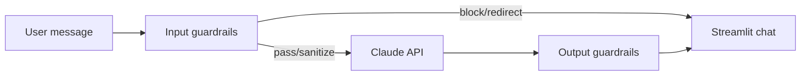

# Agent Design

> **Owner:** Ana Valderrama  
> **Last updated:** 2026-06-02  
> **Status:** Complete

## Scope

The agent helps with: dataset upload, schema confirmation, backward analysis, budget optimization interpretation, and sensitivity questions. It **refuses** general knowledge, politics, homework, jokes, and harmful requests.

## Guardrails pipeline

**Input:** length, harm, profanity, PII redaction, out-of-scope redirect, marketing keyword heuristic.  
**Output:** opinion leakage log, multi-question warning, unsourced stats flag, scope drift log.

## Workflow phases (what the agent says)

1. **Upload** — Ask for `.zip` or `.csv`; explain profiling step.
2. **Confirm** — Summarize schema, channels, budget; wait for user OK.
3. **Analysis** — Narrate each backward stage.
4. **Optimize** — Explain allocation, KKT, shadow price (blocked until Stage 7 confirmed).
5. **Explore** — Interpret charts and follow-ups.

Prompts are assembled in `agent_prompts.build_system_prompt()`. `agent.run_agent()` is wired in `app/app.py` with input/output guardrails and a no-key fallback for local demos.
