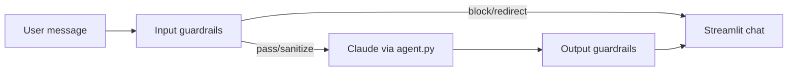

# Agent Design

> **Owner:** Ana Valderrama (base) · Piyush Sandhikar (runtime parameters)  
> **Last updated:** 2026-06-10  
> **Status:** Complete

## Scope

The agent helps with: dataset upload, schema confirmation, backward analysis, budget optimization interpretation, and sensitivity questions. It **refuses** general knowledge, politics, homework, jokes, and harmful requests.

## Guardrails pipeline



**Input:** length, harm, profanity, PII redaction, out-of-scope redirect, marketing keyword heuristic.  
**Output:** opinion leakage log, multi-question warning, unsourced stats flag, scope drift log.

## Workflow phases (what the agent says)

1. **Upload** — Ask for `.zip` or `.csv`; explain profiling step.
2. **Confirm** — Summarize schema, channels, budget; wait for user OK.
3. **Analysis** — Narrate each backward stage.
4. **Optimize** — Explain allocation, KKT, shadow price (blocked until Stage 7 confirmed).
5. **Explore** — Interpret charts and follow-ups.

Prompts are assembled in `agent_prompts.build_system_prompt()`. `agent.run_agent()` is wired in `app/app.py` with input/output guardrails and a no-key fallback for local demos.

## Runtime parameter changes (stakeholder mod v3)

The agent accepts per-channel activation thresholds (κ), ceilings (u_c), adstock
decays (λ), and total budget (B) as **runtime parameters** in natural language —
no value is hardcoded in the solve path. Defaults load from `config.yaml`;
current truth lives in `st.session_state`.

```mermaid
flowchart LR
  msg[User message]
  detect[detect_parameter_change\nregex → Claude fallback]
  valid[validate_parameter_change\nchannel, 0<κ<u_c, λ∈[0,1], B>0]
  confirm[Confirm with user]
  apply[apply_parameter_change\nsession state + params_dirty]
  resolve[maybe_resolve\nre-solve Models A/B]

  msg --> detect --> valid
  valid -->|invalid| msg
  valid -->|ok| confirm --> apply --> resolve
```

- **Extraction is hybrid:** deterministic regex first (`parse_parameter_change`),
  Claude JSON fallback only when regex finds nothing. The LLM never bypasses validation.
- **Confirm-before-apply:** the agent echoes the exact value and waits for "yes"
  (demo-safety; avoids acting on a misparse).
- **Re-solve** runs in the app layer via `optimization_pipeline.maybe_resolve()`,
  which calls the parameterized solvers with session-state κ/u_c/B (no MMM refit
  needed for κ/B/u_c changes).
- **Scope guard (D7):** only κ, λ, B, u_c are runtime-tunable. Channel set,
  saturation form, and solver internals are fixed.

## Explaining the results charts

The chatbot is text-only and cannot see the rendered figures, but every chart on
the Allocation, Curves, and Model Comparison pages is a picture of values that
already live in `st.session_state`. `summarize_results_context(session_state)`
(in `agent_prompts.py`) builds a compact plain-text digest of those numbers —
per-channel recommended vs baseline spend, predicted vs baseline conversions,
lift, shadow price λ\*, saturation `a`/`b`, activation κ/u_c, and the A/B/C
comparison with adstock λ. The digest is injected into the system prompt via the
`results_context` argument of `build_system_prompt`, so the user can ask "why is
Google Shopping so tall?" or "why does Model C beat A?" and get an answer grounded
in the exact on-screen numbers. The digest is empty until `optim_result` exists,
so pre-optimization turns are unaffected.
