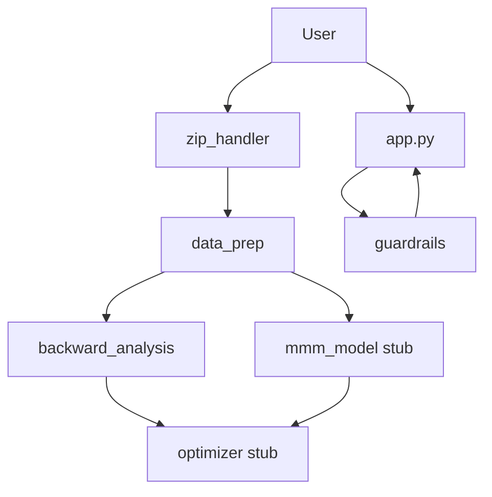

# Architecture

> **Owner:** Ana Valderrama  
> **Last updated:** 2026-06-02  
> **Status:** In Progress

## Data flow

## Integration contracts

1. **Ana → Gregory:** `data/processed/mmm_train.csv` (cleaned, adstock, train split)
2. **Ana → Validation:** `data/processed/mmm_test.csv` (holdout, last 3 months per series)
3. **Ana → Meghna:** `BackwardAnalysisResult` with `confirmed_by_user=True`
4. **Ana → Piyush:** `build_system_prompt(phase, turn_index)`
5. **Gregory → Meghna:** `data/processed/channel_params.json` (`a`, `b` per channel)

## Streamlit session state keys

| Key | Purpose |
|-----|---------|
| `phase` | Workflow phase for prompts |
| `turn_index` | Chat turn counter |
| `conversation_history` | Chat messages |
| `upload_complete` | Upload step done |
| `schema_confirmed` | User confirmed schema |
| `backward_analysis_confirmed` | User confirmed Stage 7 — unlocks optimizer |
| `optimization_complete` | Optimizer finished |
| `cleaned_df` | Processed DataFrame |
| `train_df` / `test_df` | Splits |
| `eda_report` | Plotly EDA dict |
| `raw_path` | Absolute path to saved raw CSV |
| `schema_profile` | `SchemaProfile` dataclass |
| `backward_analysis_result` | Full backward analysis |
| `confirmed_target` / `confirmed_budget` | User form inputs |
| `guardrails` | `GuardrailsService` instance |
