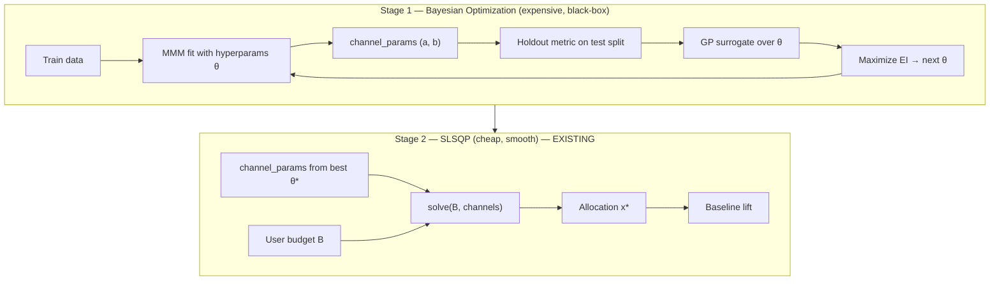

# Bayesian Optimization Integration Plan

> **Owner:** Meghna Advani (draft for team review)  
> **Last updated:** 2026-06-09  
> **Status:** Implemented (Stage 1 offline BO; SLSQP unchanged)  
> **Sources:** Lecture 7 (Bayesian Optimization), `retailsense_bo_hyperparameter.ipynb`, current `optimizer.py` + `mmm_model.py`

---

## Purpose of this document

This plan proposes **where and how** to incorporate **Bayesian Optimization (BO)** into our MMM Budget Allocation Agent — **without replacing** the existing SLSQP budget allocator.

**Please review before implementation.** Owners and scope below are suggestions; adjust in team sync.

---

## Executive summary

| Layer | Problem | Tool today | Proposed tool |
|-------|---------|------------|---------------|
| **Predict** (fit saturation curves) | Tune MMM hyperparameters; each full refit is costly | Fixed values in `config.yaml` / `mmm_model.py` | **Bayesian Optimization** (GP + EI) |
| **Optimize** (allocate budget) | Maximize Σ aᵢ(1−e^(−bᵢxᵢ)) s.t. Σx ≤ B | **SLSQP** multistart (`optimizer.py`) | **Keep SLSQP** (no change) |
| **Evaluate** (business case) | Lift vs historical baseline | `baseline.py` | **Keep as-is** |

**One-line pitch for the professor:**

> We use **BO to tune how we predict** (MMM hyperparameters), and **SLSQP to optimize how we allocate** (budget given those predictions).

---

## Why BO does *not* replace SLSQP for budget allocation

Lecture 7 contrasts two regimes:

| Regime | Characteristics | Right method (lecture) | Our case |
|--------|-----------------|------------------------|----------|
| **Cheap + smooth + gradients** | Milliseconds per eval | SLSQP, L-BFGS | **5-channel allocation** — analytical gradient, KKT, ~50 multistarts |
| **Expensive + black-box** | Hours/dollars per eval | Bayesian Optimization | **MMM refit + holdout score** — analogous to RetailSense MLP training |

Our allocation objective is a **5-variable sum of exponentials** with a linear budget constraint. One `solve()` call takes milliseconds. Replacing SLSQP with BO here would add complexity without matching the lecture’s motivation (“each evaluation costs $10,000 and you only have 30 tries”).

**Team agreement needed:** Confirm we present this as a **two-stage** pipeline, not a swap of solvers.

---

## RetailSense → our project (mapping)

| RetailSense (lecture / notebook) | Our MMM Budget Agent |
|----------------------------------|---------------------|
| Hyperparameter config (lr, alpha, neurons, batch) | MMM tuning config (adstock decays, ridge weight, …) |
| Expensive evaluation | `run_fitting()` + holdout metric on `mmm_test.csv` |
| Reward / objective | Test R², RMSE, or holdout predicted conversions |
| Search space | Continuous (log-uniform for decays); optional categoricals later |
| BO budget | **30 evaluations** (5 random init + 25 EI) — same as lecture |
| Output | Better `channel_params.json` → better allocations + lift |
| Reference implementation | `retailsense_bo_hyperparameter.ipynb` (sklearn GP + EI) |

---

## Proposed architecture



**Stage 1** = exploration–exploitation over **model** hyperparameters (Lecture 7 theme).  
**Stage 2** = constrained nonlinear optimization over **spend** (already implemented).

---

## What we would tune (Stage 1 search space)

**Phase 1 — minimal, team-friendly scope:**

| Parameter | Current location | Proposed search range | Notes |
|-----------|------------------|----------------------|-------|
| Adstock `decay_rates` (×5 channels) | `config.yaml` → `adstock.decay_rates` | e.g. [0.05, 0.6] log-uniform | Affects transformed spend before MMM fit |
| `REG_B_WEIGHT` | `mmm_model.py` constant | e.g. [0.01, 0.2] linear | Ridge on log-scaled b in joint fit |

**Phase 2 — optional extensions (later):**

- Aggregation frequency (`monthly` vs `daily`)
- Per-channel inclusion / caps informed by `quality_checks()` flags
- Penalty terms in BO objective for weak-channel warnings

**Not in scope for BO v1:**

- Segment / product / geo budgets (new decision variables + data model)
- Thompson sampling for live sequential channel “pulls” (bandit deployment story)

---

## BO algorithm (mirror lecture + notebook)

1. **Initialize:** evaluate objective at `n_init = 5` random θ (uniform in encoded space).
2. **Loop** `n_iter = 25` times:
   - Fit **Gaussian Process** surrogate on all `(θ, metric)` observations.
   - Optimize **Expected Improvement (EI)** over candidate θ to pick next point.
   - Run expensive evaluation: refit MMM → score on holdout.
   - Append observation; repeat.
3. **Return:** `θ*` with best holdout metric → export `channel_params_bo.json`.

**Acquisition:** EI (lecture default; implemented in `retailsense_bo_hyperparameter.ipynb`).

**Surrogate:** `sklearn.gaussian_process.GaussianProcessRegressor` + RBF kernel (matches notebook).

**Alternative for production (lecture slide 18):** Optuna / scikit-optimize — document as future path; start with sklearn for course alignment.

---

## Proposed code / doc changes (implementation checklist)

### New

| Item | Owner (suggested) | Description |
|------|-------------------|-------------|
| `src/bo_mmm_tuning.py` | Meghna | BO loop: encode θ, EI, GP, history |
| `notebooks/03_bo_mmm_tuning.ipynb` | Meghna | Professor-facing demo: bandits → GP → MMM BO vs random |
| `tests/test_bo_mmm_tuning.py` | Meghna | Mock cheap objective; verify EI loop |
| `data/processed/channel_params_bo.json` | Generated | Best θ* params (gitignored like other processed outputs) |

### Extend (small contracts)

| Item | Owner (suggested) | Description |
|------|-------------------|-------------|
| `src/mmm_model.py` | Gregory | `run_fitting(..., adstock_overrides=, reg_b_weight=)` for BO trials |
| `src/optimization_pipeline.py` | Meghna | Optional flag: load BO-tuned params vs default JSON |
| `config.yaml` | Meghna + Ana | `mmm_tuning:` block (`enabled`, `n_init`, `n_iter`, ranges) |

### Document

| Item | Owner (suggested) | Description |
|------|-------------------|-------------|
| `docs/optimization_problem_spec.md` | Meghna | New §: BO layer vs SLSQP layer |
| `docs/architecture.md` | Ana | Two-stage diagram + session keys if any |
| `README.md` | Meghna | Status row: `bo_mmm_tuning` |
| `DEVELOPMENT_LOG.md` | Implementer | Entry when merged |

### Unchanged

| Item | Reason |
|------|--------|
| `src/optimizer.py` (`solve`, KKT, SLSQP) | Correct tool for allocation per lecture |
| `src/baseline.py` | Still compares allocation to historical mix |
| Streamlit flow (v1) | BO runs **offline**; app consumes best JSON |

---

## Config sketch (for discussion)

```yaml
mmm_tuning:
  enabled: false          # default off — BO is slow (~30 full refits)
  n_init: 5
  n_iter: 25
  acquisition: EI
  objective: test_r2     # alternatives: test_rmse, test_mae
  search_space:
    reg_b_weight: [0.01, 0.2]
    adstock_decay: [0.05, 0.6]   # applied per channel unless we add "shared" mode
  output_path: "data/processed/channel_params_bo.json"
```

---

## How this relates to “only 2 of 5 channels get budget”

| Cause | Would BO help? |
|-------|----------------|
| Weak MMM fits (e.g. Instagram a ≈ 0, Paid Search tiny a) | **Partially** — better θ may improve holdout fit |
| Collinearity in joint fit | **Limited** — may still need drop/cap/floor in optimizer |
| Optimizer maximizing given curves | **N/A** — SLSQP is correct; fix curves first |

BO is **not** a substitute for business constraints (channel floors, caps) or dropping unreliable channels. It improves **Stage 1** before **Stage 2** runs.

---

## Dependencies (if implemented)

| Option | New dependency? | Notes |
|--------|-----------------|-------|
| sklearn GP + hand-rolled EI | **No** (already in stack) | Matches `retailsense_bo_hyperparameter.ipynb` |
| scikit-optimize | Yes — `scikit-optimize` | `gp_minimize`, teaching-friendly |
| Optuna | Yes — `optuna` | Lecture “production” recommendation; TPE not pure GP-EI |

**Proposal:** Implement with **sklearn only** first; cite Optuna in final report as production alternative.

---

## Evaluation plan (for final report / demo)

Compare on the **same 30-evaluation budget**:

| Method | What we measure |
|--------|-----------------|
| Grid search (subset) | Best holdout R²; eval count to reach 95% of best |
| Random search | Same |
| Bayesian Optimization (EI) | Same — expect fewer evals to good metric (lecture: ~12 vs ~25 random) |

**Downstream:** Run `solve()` at fixed B (e.g. $3.5M) with default vs BO-tuned `channel_params` — report allocation diff and lift vs baseline.

---

## Suggested implementation order

1. Team sign-off on this doc (this step).
2. Docs + architecture diagram update (no runtime risk).
3. `bo_mmm_tuning.py` + unit tests with mock objective.
4. Gregory reviews `mmm_model` hook for θ overrides.
5. Notebook `03_bo_mmm_tuning.ipynb` for course narrative.
6. One offline BO run on Conjura data → `channel_params_bo.json`.
7. Optional: pipeline flag in app to use BO-tuned params.
8. Final report: grid vs random vs BO table (RetailSense-style).

**Rough effort:** 2–3 focused sessions for core BO; +1 if Streamlit integration.

---

## Team decisions needed

Please comment or discuss in sync:

- [ ] **Agree:** BO targets **MMM tuning**, not budget allocation.
- [ ] **Agree:** SLSQP + KKT remain the allocation engine.
- [ ] **Search space:** Start with adstock decays + `REG_B_WEIGHT` only?
- [ ] **Objective:** `test_r2` vs `test_rmse` vs composite with quality penalties?
- [ ] **Runtime:** BO offline only (no Streamlit button) for final demo?
- [ ] **Owner split:** Gregory (`mmm_model` hooks) vs Meghna (BO module + notebook)?
- [ ] **Dependencies:** sklearn-only vs add `scikit-optimize` / `optuna`?

---

## Professor Q&A (shared talking points)

**Q: Why not BO for budget allocation?**  
A: Evaluations are microseconds; we have gradients and KKT. Lecture 7 assigns that to SLSQP, not BO.

**Q: Where is exploration–exploitation?**  
A: In MMM hyperparameter search — EI explores uncertain θ regions and exploits high holdout R² regions.

**Q: Where are KKT and shadow price λ?**  
A: Unchanged on the **allocation** problem (Stage 2).

**Q: Connection to RetailSense?**  
A: Same BO loop; we swap MLP hyperparameters for MMM tuning parameters and AUC for holdout fit metric.

---

## References in repo

| Asset | Path |
|-------|------|
| Lecture slides | `lecture7_bayesian_optimization (1).pdf` |
| RetailSense notebook | `retailsense_bo_hyperparameter.ipynb` |
| Current optimizer spec | `docs/optimization_problem_spec.md` |
| Optimizer implementation | `src/optimizer.py` |
| MMM implementation | `src/mmm_model.py` |
| Integration pipeline | `src/optimization_pipeline.py` |

---

## Open questions for teammates

1. Is **30-eval BO** acceptable runtime for a one-time offline run before demo day?
2. Should BO objective **penalize** `quality_checks()` flags (weak Instagram, under-saturated Facebook)?
3. Do we want **one shared adstock decay** (1D BO) first to de-risk, then 5D per-channel?
4. Should merged params replace default `channel_params.json` on `main`, or stay as optional `channel_params_bo.json`?

---

*End of plan — please add comments in PR or team channel before Meghna opens an implementation branch.*
